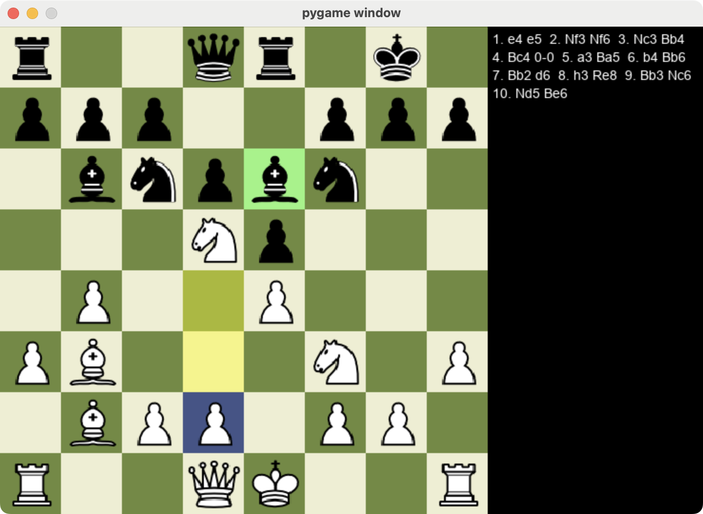
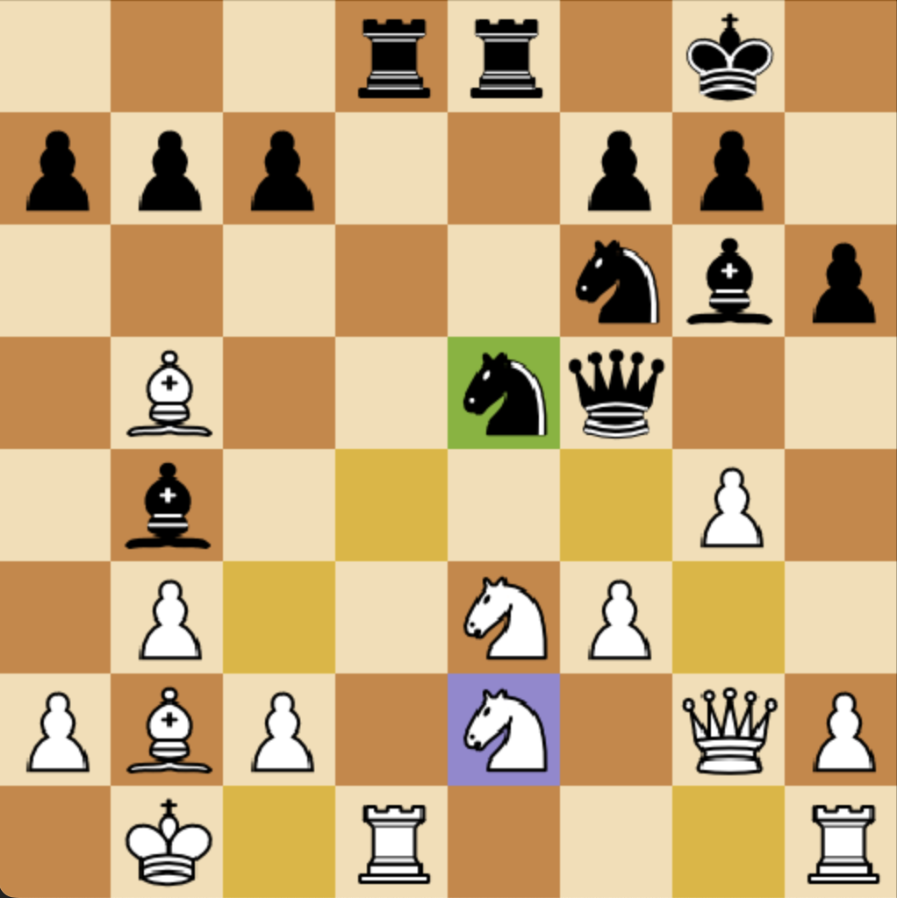
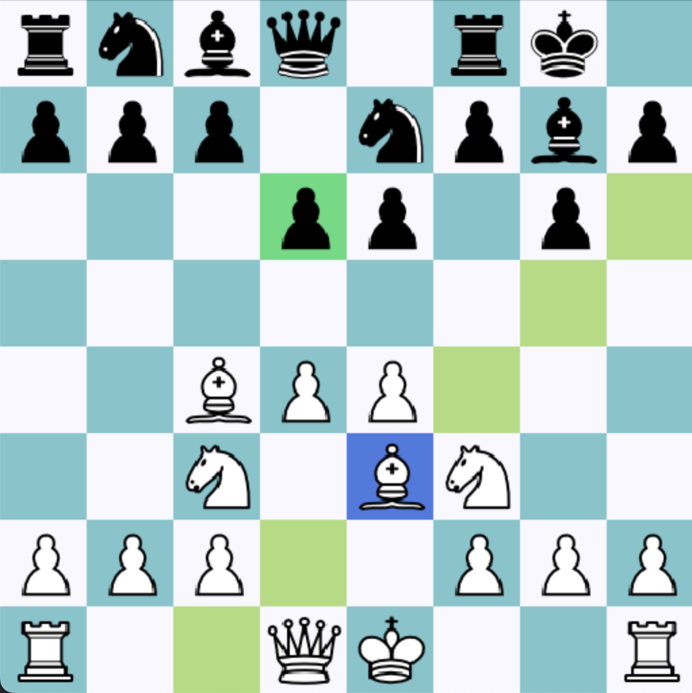

# Chess AI

Fully functioning program for analyzing and playing chess again an AI. Developed using PyGame.
 

# How to play

* Run main.py
* Choose to play against the computer or another player by setting the `player-two` flag
* Set the difficulty of the computer
* Press `z` to undo the previous move
* Press `r` to reset the game
* Enjoy!

# Additonal Features
* Game log on the right side panel
* Move animations
* Piece highlighting
* Custom chess board and pieces

  
  

# Algorithm
Implemented a modified version of the min-max algorithm to find the best possible moves. Used alpha-beta pruning to eliminate possiblities and speed up the search process. 

The engine will evaluate and score each chess position by factoring in the material advantage, piece activity, and king safety. 
 

# Future Improvements
* Start game menu
* 3 move repetition rule
* Opening book for the computer
* Use numpy arrays to represent the chess board
* Clean up move log notations
